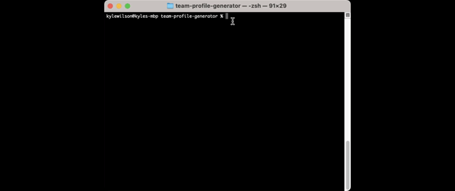
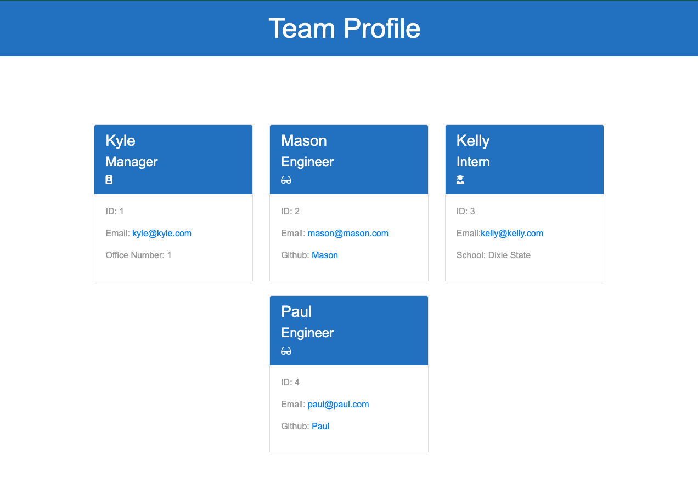

<h1 align="center">Team Profile Generator</h1>

An Object-Oriented Programming (OOP) Demonstration

    
    
    
    

  

    
    
    
    
    

 
 ## Description
Team Profile Generator is a [node.js](https://nodejs.org/en/) application that creates a detailed and costomizable visual profile of a "team". Team Profile Generator gathers specific information via [Inquirer package](https://www.npmjs.com/package/inquirer) from the user related to members of their desierd team. The user can add as many members to their team as the would like

## Installation & Operation

- run npm install to install required dependencies
- run `node index.js` to start the application
- enter the information that the application requests
- upon completion open the index.html file in the bowser to view your results

---
## Jest Demo

Click [here](https://drive.google.com/file/d/18ZDyy9hN61xhV162QY_XNneJDJce4hEB/view) to open the Jest Demo video in a new tab.
---
## Application Demo

Click [here](https://drive.google.com/file/d/1U4c4tLg-CSB2LbFFcuDqTkHIxDRzTWB0/view) to open the application demo video in a new tab.

---

## Application output example

---

## Built With

- HTML
- CSS
- Bootstrap
- Font Awesome
- JavaScrpit
- Node.js
- Inquirer (NPM)
- Jest

## Built By
Kyle's big 🧠

